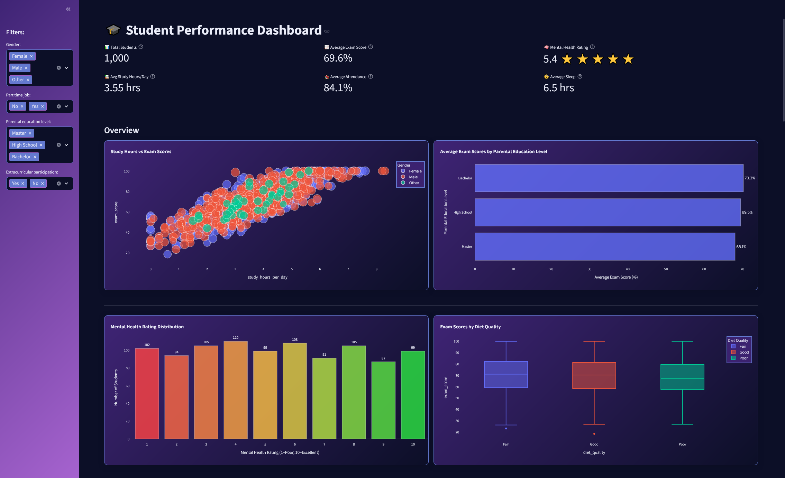
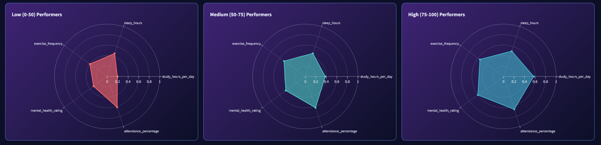
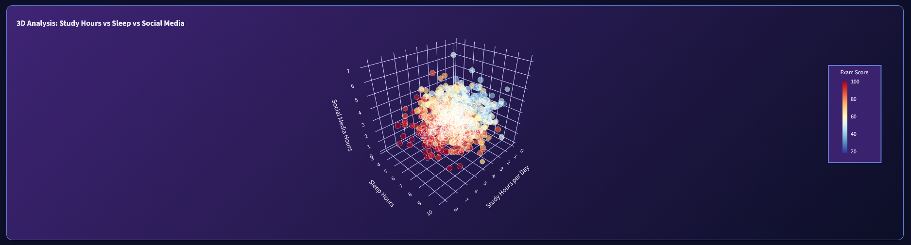

# Student Performance Analysis Dashboard

An interactive dashboard built with Streamlit for visualizing and analyzing the relationship between student habits and academic performance.

## Table of Contents
- [Student Performance Analysis Dashboard](#student-performance-analysis-dashboard)
  - [Table of Contents](#table-of-contents)
  - [Screenshots](#screenshots)
  - [Features](#features)
  - [Tech Stack](#tech-stack)
  - [Dataset](#dataset)
  - [Setup and Running](#setup-and-running)
    - [1. Prerequisites](#1-prerequisites)
    - [2. Installation](#2-installation)
    - [3. Running the application](#3-running-the-application)

## Screenshots

<p align="center">
  
  
  
</p>

## Features

The dashboard provides tools for exploring student performance and lifestyle factors:

- **Interactive Filtering**: Filter by gender, part-time job status, parental education, and extracurricular participation.  
- **Key Metrics**: Quick view of total students, average exam score, and average mental health rating.  
- **Exploratory Visualizations**: Scatter plots, bar charts, histograms, violin plots.  
- **Correlation Analysis**: Correlation matrix and parallel coordinates plots.  
- **Profile Comparison**: Radar charts and sunburst charts for group comparisons.  
- **Advanced Visuals**: 3D scatter plot for multi-variable relationships.  
- **Custom Styling**: Dark theme with CSS overrides for readability.  

## Tech Stack

- **Python**  
- **Streamlit** – Web application framework  
- **Pandas** – Data processing and analysis  
- **Plotly** – Interactive visualizations  
- **Kaggle** – Dataset source (with `kagglehub` for automatic downloads)  
- **CSS** – Custom styling  

## Dataset

The project uses the **"Student Habits vs Academic Performance"** dataset from Kaggle, containing 1,000 synthetic student records (demographics, study habits, lifestyle factors, and academic outcomes).  

- **Source:** [Kaggle Dataset](https://www.kaggle.com/datasets/jayaantanaath/student-habits-vs-academic-performance)  
- **Note:** The dataset is synthetic, not real student data. Check Kaggle for licensing details.  

## Setup and Running

### 1. Prerequisites
- Python 3.12 or newer  
- `pip` and `venv`  

### 2. Installation

Clone the repository:
```bash
git clone https://github.com/Matej293/student-performance-dashboard
cd student-performance-dashboard
```

2.  **Create and activate a virtual environment:**
```bash
# Create the environment
python -m venv venv

# Activation (Windows)
venv\Scripts\activate

# Activation (macOS/Linux)
source venv/bin/activate
```

3.  **Install the required libraries:**
```bash
pip install -r requirements.txt
```

4.  **Kaggle API (Optional):**
For the automatic download of the latest dataset, you need to have your Kaggle API credentials (`kaggle.json`) set up. Alternatively, you can manually download the `student_habits_performance.csv` file and place it in the project's root directory.

### 3. Running the application

After a successful installation, run the application in your default web browser with the following command:

```bash
streamlit run app.py
```